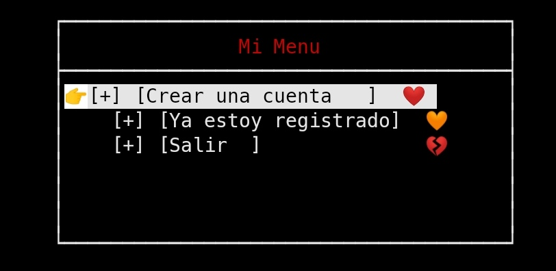

# termux_login



Termux es un emulador de terminal de Android y una aplicación de entorno Linux que funciona directamente sin necesidad de enraizamiento o configuración.

El no cuenta con un inicio de cecion  para  empezar a autenticarse en el equipo.

La autenticación sirve para comprobar que el usuario situado delante de la consola es quien pretende ser. Tiene que facilitar su identidad (nombre de inicio de sesión o login) y una prueba de esta (contraseña) para conectarse. Lo cual es el objetivo de este proyecto. 


# 👀 Requisitos

Contar con un teclado con las sigientes caracteristicas:


 👇Mi sugerencia👇 
**Hacker's Keyboard** [Teclado de cuatro o cinco filas](https://f-droid.org/packages/org.pocketworkstation.pckeyboard/)


# 🕋 Dependencias  

```sh
apt install clang++ git -y 
```

# 📶 Intalacion

```sh
git clone [URL]
cd termux_login
make
```

# ⚙️  Configuracion

En el directorio de `$HOME/.local/share/termux_login/` contaras con un archivo `conf.json` para tener el  poder 💪 de configurar a su gusto.

### Ejemplo del alchivo de configuración
```json
{
"icon_menu" : ["🧡", "❤️ ," 💔"],
"brand_menu" : "👉",
}
```

# 🗽  Recursos

Learning [ncurses](https://github.com/nasciiboy/NCURSES-Programming-HOWTO/blob/master/NCURSES-Programming-HOWTO-es.org)

Wiki [JSON](https://en.m.wikibooks.org/wiki/JsonCpp)

[La documentación de JsonCpp](http://open-source-parsers.github.io/jsoncpp-docs/doxygen/index.html#_intro)

Cómo hacer un [Makefile](https://hernandis.me/2017/03/20/como-hacer-un-makefile.html)
